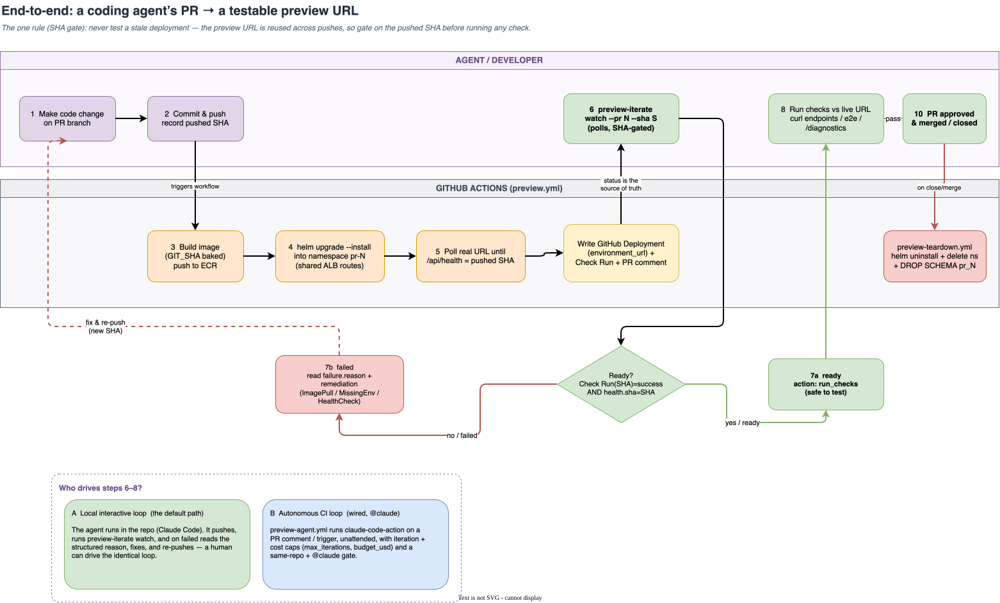
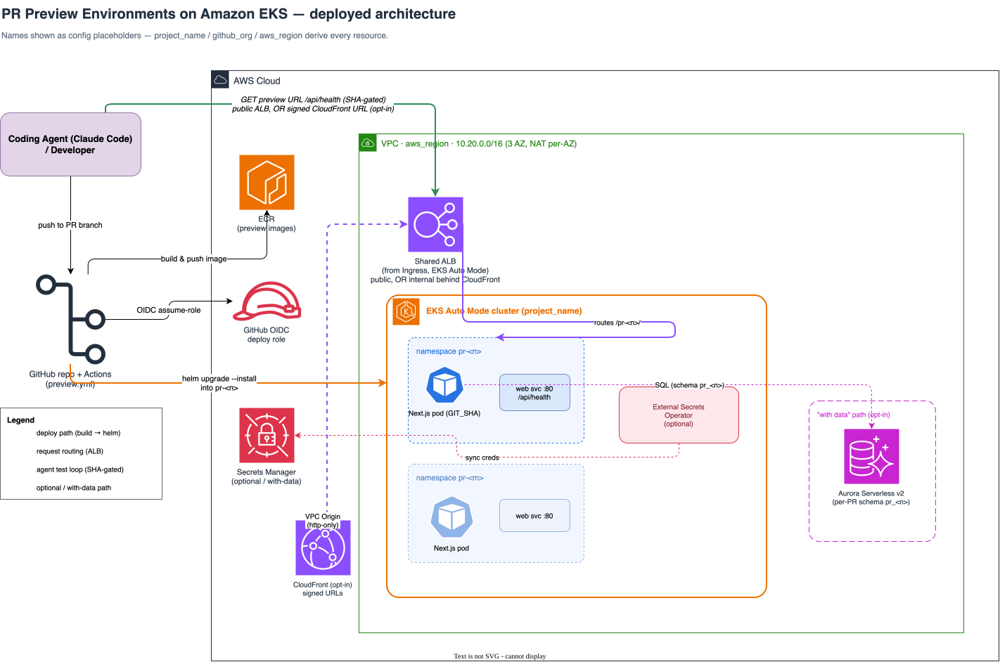

# PR Preview Environments on Amazon EKS — agent-first

> **Give your coding agent a real URL to test against.**
> Every pull request gets its own isolated deployment on Amazon EKS, at its own
> URL. A coding agent (or a human) opens a PR, waits for the preview to go green
> for *the exact commit it just pushed*, tests the live URL, and iterates on
> failures — a per-PR preview loop, on your own cluster.

One Pull Request → one **Preview Environment** at its own URL: created on open,
updated on every push (SHA-gated, so an agent never tests stale code), destroyed
on close.

<p align="center">
  
</p>

---

## Why this exists

Coding agents write code fast, but they need somewhere real to test it —
production-like, isolated, and reachable at a URL — *before* a human reviews the
PR. This project gives every PR that environment on Amazon EKS, and ships the
agent loop that drives it:

- **The one rule — never test a stale deployment.** A preview URL is reused
  across pushes, so after a fix the old pod may still be serving old code. The
  loop gates on **both** the Check Run for the pushed SHA being green **and**
  `GET /api/health` reporting that same SHA before it runs a single test.
- **Two ways to drive it.** A **local interactive loop** (the hero: an agent
  running in your repo with the `preview-iterate` skill) and an **autonomous CI
  loop** (`@claude` on a PR, wired to the official Claude Code GitHub Action).
- **Real infrastructure, one config file.** EKS Auto Mode, a shared ALB, ECR,
  GitHub OIDC — all named from three values in `project.env`.

---

## Prerequisites

**To try it locally on kind (no AWS):** [Docker](https://docs.docker.com/get-docker/),
[kind](https://kind.sigs.k8s.io/), [kubectl](https://kubernetes.io/docs/tasks/tools/),
[Helm](https://helm.sh/docs/intro/install/), Node.js ≥ 18, and `jq`.

**To deploy to AWS EKS,** additionally: the [AWS CLI](https://docs.aws.amazon.com/cli/)
(authenticated with **admin-level** credentials — the CDK step creates a VPC, NAT,
ECR, and an IAM role), [eksctl](https://eksctl.io/), and the AWS CDK
(`npx cdk`, installed by `make install`). See [`docs/runbook.md`](docs/runbook.md)
for the exact IAM footprint and cost notes.

## Quick start

Two layers: try the loop **locally on kind** (no AWS) in minutes, then deploy to
**AWS EKS** when you want real preview URLs.

### 1. Configure (three values)

```bash
# Edit the three values in project.env directly (it's the file every script sources):
#   PROJECT_NAME (default pr-preview), GITHUB_ORG, AWS_REGION
source project.env
make install                       # deps for app, skill, infra
```

> **Local overrides:** keep private/experimental values in `project.local.env`
> (gitignored). `source project.env` loads it automatically when present, so your
> local edits win without touching the tracked template.

### 2. Try it locally on kind (no AWS, no database)

```bash
make kind-up                                   # kind + ingress-nginx + metrics-server
make preview-up PR=42 SHA=$(git rev-parse --short HEAD)
curl -s localhost:8080/pr-42/api/health | jq .  # → {"ready":true,"sha":"<pushed-sha>",...}
make preview-down PR=42
```

Run the test suite any time with `make test` (see [Testing & CI](#testing--ci)).

### 3. Deploy to AWS EKS

The default path provisions with **CDK (VPC + ECR + OIDC) + eksctl (the EKS Auto
Mode cluster)** and needs **no database**:

```bash
source project.env
cd infra && npm ci && npx cdk bootstrap && npx cdk deploy PrPreviewNetwork PrPreviewCicd
cd .. && ./scripts/render-eksctl-config.sh                 # fills eksctl config from CDK outputs
eksctl create cluster -f eksctl/eksctl-cluster.rendered.yaml
aws eks update-kubeconfig --name "$PROJECT_NAME" --region "$AWS_REGION"
kubectl apply -f charts/preview-env/alb-ingressclass.yaml  # once per cluster

# ⚠️ REQUIRED on the eksctl path — grant the deploy role Kubernetes RBAC. Without
# this the workflow authenticates to AWS fine, then every helm/kubectl call fails
# `Unauthorized`. (CDK does this automatically only on the pure-CDK cluster path.)
ROLE_ARN="$(aws cloudformation describe-stacks --stack-name PrPreviewCicd \
  --query "Stacks[0].Outputs[?OutputKey=='GithubDeployRoleArn'].OutputValue" --output text)"
aws eks create-access-entry --cluster-name "$PROJECT_NAME" --region "$AWS_REGION" \
  --principal-arn "$ROLE_ARN" --type STANDARD
aws eks associate-access-policy --cluster-name "$PROJECT_NAME" --region "$AWS_REGION" \
  --principal-arn "$ROLE_ARN" \
  --policy-arn arn:aws:eks::aws:cluster-access-policy/AmazonEKSClusterAdminPolicy \
  --access-scope type=cluster

gh secret set AWS_DEPLOY_ROLE_ARN --repo "$GITHUB_ORG/<your-app>" --body "$ROLE_ARN"
./scripts/onboard-app.sh repo --repo "$GITHUB_ORG/<your-app>"   # scaffolds caller workflows
```

Open a PR in your app repo → the reusable workflow builds, deploys, and comments
the preview URL. Full walkthrough (incl. the **optional database**, the opt-in
pure-CDK cluster, and **host-mode**): [`docs/runbook.md`](docs/runbook.md).

> **OIDC subject formats are handled for you.** GitHub changed the default token
> `sub` on **2026-07-15**: repos created (or renamed/transferred) after that date
> send an *immutable* subject — `repo:<org>@<orgId>/<repo>@<repoId>:<ref>` — instead
> of `repo:<org>/<repo>:<ref>`. The deploy role trusts **both** forms, so new and
> old repos work with no extra config. If assume-role still fails, run
> [`scripts/diagnose-oidc.sh`](scripts/diagnose-oidc.sh) — it reconciles the sub your
> repo presents against the live trust and prints the fix. Details:
> [`docs/github-actions.md`](docs/github-actions.md).

### 4. Drive the agent loop

```bash
# after you push a fix to a PR branch, record the SHA and:
node skills/preview-iterate/preview-skill.mjs watch \
  --repo "$GITHUB_ORG/<your-app>" --pr 42 --sha <pushed-sha>
# exits 0 when the preview is READY for that SHA; exits 1 with a structured
# failure.reason + remediation on failure — the loop an agent (or you) iterates on.
```

For the unattended version, comment `@claude` on a PR (see the autonomous CI
loop in [`docs/agent-loop.md`](docs/agent-loop.md)).

---

## What's here

| Path | What |
| --- | --- |
| `project.env` | The one config file — `project_name` / `github_org` / `aws_region` derive every resource name |
| `app/` | Next.js reference workload (`output: standalone`); `/api/health` returns the build SHA; `/diagnostics` debug page |
| `charts/preview-env/` | Helm chart for one Preview Environment — dual routing, guardrails (quota / limits / default-deny NetworkPolicy / PDB), optional ESO + access protection |
| `infra/` | AWS CDK (TypeScript): VPC, ECR, GitHub OIDC deploy role, optional Aurora Serverless v2, opt-in EKS Auto Mode cluster (+ assertion & cdk-nag tests) |
| `eksctl/` | The proven EKS Auto Mode cluster config (rendered from CDK outputs) |
| `.github/workflows/` | `ci.yml` (test gate) + reusable `preview.yml`, `preview-teardown.yml`, `preview-sweep.yml`, `preview-agent.yml` |
| `skills/` | Agent skills: `preview-iterate` (SHA-gated loop), `onboard-app` (onboard/offboard), `get-pr-preview-endpoint` (droppable URL resolver) |
| `scripts/` | Cluster + preview operations (kind harness, onboard, render-eksctl, verify-host-mode, sweep, CI helpers) |
| `docs/` | [Architecture](docs/ARCHITECTURE.md), [runbook](docs/runbook.md), [onboarding](docs/onboarding.md), [agent loop](docs/agent-loop.md), [host mode](docs/host-mode.md), [ABCA integration](docs/abca-integration.md), [CloudFront front-door](docs/design-cloudfront-frontdoor.md), [verification](docs/verification.md), [next steps](docs/next-steps.md), diagrams |
| `scripts/demo/` | ABCA integration demo — submit a task, deploy the PR's preview, then screenshot **and test** the live URL back onto the PR ([docs/abca-integration.md](docs/abca-integration.md)) |

---

## Features

- **Auto preview per PR** at a branch-stable URL, updated on every push.
- **SHA-gated readiness** so an agent never validates a stale deployment.
- **Status surfaced into the PR:** a GitHub Deployment (`environment_url`) + a
  Check Run (with a structured failure reason) + a bot comment. There is **no
  control-plane service** — GitHub is the source of truth.
- **Database optional:** the default needs none; opt in to Aurora Serverless v2
  with **per-PR Postgres schema isolation** (`schema pr_<n>`) via External
  Secrets Operator.
- **Per-PR isolation + guardrails:** own namespace, ResourceQuota, LimitRange,
  default-deny NetworkPolicy, PDB.
- **Reliable teardown** on PR close, plus a scheduled sweep that reaps orphans.
- **Two routing modes:** `path` (default, no DNS) and `host`
  (`pr-<n>.<domain>`, image reuse) — host-mode routing is
  [verifiable with no public domain](docs/host-mode.md).
- **Optional ALB-OIDC access protection**, structured
  logs + a per-deploy `time_to_ready` metric.
- **Autonomous CI agent** (`@claude`) with write-access-author gate + iteration/cost caps.
- **Optional HTTP Basic Auth** (`basicAuth.enabled`) at the app layer, `/api/health`
  exempt so the readiness gate still works.
- **Optional [CloudFront front-door](docs/design-cloudfront-frontdoor.md)** —
  short-TTL **signed URLs** over a **private** ALB (CloudFront VPC Origin), for
  access control stronger than a static password with trusted TLS and no public
  domain. The ALB is not internet-reachable; built + verified on EKS Auto Mode.
- **[ABCA integration](docs/abca-integration.md):** pairs with
  [Autonomous Background Coding Agents](https://github.com/aws-samples/sample-autonomous-cloud-coding-agents)
  — ABCA opens a PR, this platform gives it a live preview URL and emits the
  `deployment_status` ABCA screenshots back onto the PR. An optional **test-task**
  then verifies the live preview (SHA-gate, routing, page renders, change is live)
  and posts a pass/fail comment. A fully autonomous change → testable preview →
  verified-and-tested loop.

---

## Configuration

Everything is named from **three values** in [`project.env`](project.env):

```bash
PROJECT_NAME=pr-preview      # → cluster, ECR repo, IAM role, node profile, secret path, ALB group, CFN stacks
GITHUB_ORG=your-org          # → the org whose repos may assume the deploy role (OIDC)
AWS_REGION=us-east-1
```

Change `PROJECT_NAME` and every AWS/Kubernetes resource name follows. The
Kubernetes label domain used for selection and teardown (`preview.pr-preview/*`)
is a fixed internal constant, so it never drifts when you rename resources.

---

## Testing & CI

`make test` runs the same suite the CI gate runs
([`.github/workflows/ci.yml`](.github/workflows/ci.yml)):

| Suite | What it covers |
| --- | --- |
| bash lib | deploy + onboard/offboard helpers |
| app unit | health/runtime/logger of the reference workload |
| skill unit | SHA-gate decision logic + agent loop control |
| helm render | both routing modes + guardrails + protection + ESO |
| CDK | stack assertions + cdk-nag security gate |
| native e2e | real build + standalone server (simple / slow-boot / multi-commit / multi-PR) |

Plus `actionlint` on workflows and `helm lint` on the chart.

Full verification (incl. live-EKS proof): [`docs/verification.md`](docs/verification.md).

---

## Architecture

Read [`docs/ARCHITECTURE.md`](docs/ARCHITECTURE.md) for the full picture and the
two diagrams. In one line: **GitHub Actions builds and `helm upgrade --install`s
each PR into its own namespace on a shared ALB; readiness is proven by polling
the real URL for the pushed SHA; status lives in GitHub Deployments + Check
Runs; the agent loop reads that and iterates.**

<p align="center">
  
</p>

---

## Security & contributing

- Preview access is **public by default**; opt into basic auth or ALB-OIDC
  protection in the chart. The autonomous agent runs behind a **write-access-author
  + `@claude` guard** and never interpolates untrusted PR/comment text into a command.
- See [`CONTRIBUTING.md`](CONTRIBUTING.md) and
  [`CODE_OF_CONDUCT.md`](CODE_OF_CONDUCT.md). Report security issues via the
  [AWS vulnerability reporting page](http://aws.amazon.com/security/vulnerability-reporting/),
  not a public issue.

## License

MIT-0. See [`LICENSE`](LICENSE) and [`NOTICE.txt`](NOTICE.txt).
