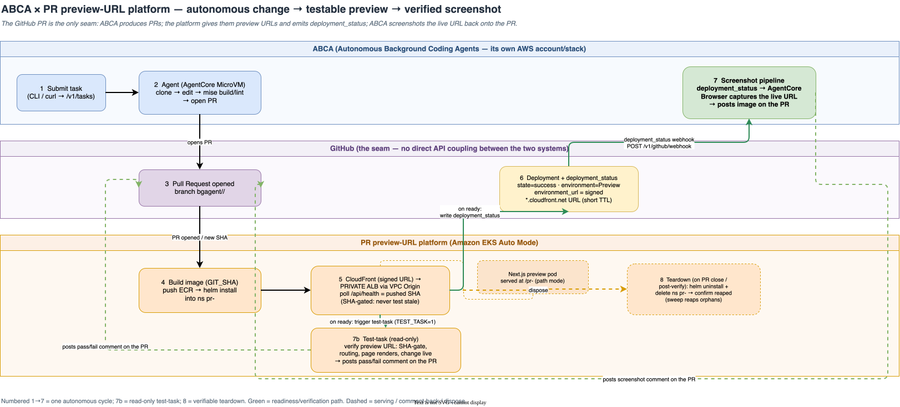

# Using ABCA with the PR preview-URL platform

This guide shows how to combine two AWS open-source projects into one
autonomous loop:

- **[ABCA](https://github.com/aws-samples/sample-autonomous-cloud-coding-agents)**
  — Autonomous Background Coding Agents. You submit a task; an agent clones a
  target repo, writes code, runs the build, and opens a **pull request**.
- **This platform** — gives every PR its own isolated **preview environment** on
  Amazon EKS at a live URL, SHA-gated so an agent never tests stale code.

Together: **ABCA writes the code → the platform gives that PR a testable URL →
ABCA screenshots the live change back onto the PR.** No human in the loop.

<p align="center">
  
</p>

## How they connect — the GitHub PR is the seam

Neither system calls the other's API. They meet at **GitHub**, through two
standard GitHub surfaces:

1. **Pull request** — ABCA opens it (branch `bgagent/<task_id>/<slug>`); the
   platform reacts to the PR like any other, builds the image, and deploys a
   preview.
2. **`deployment_status` webhook** — when the preview is ready, the platform
   writes a GitHub Deployment + a `deployment_status` (`state=success`,
   `environment_url=<preview URL>`, `environment=Preview`). ABCA's built-in
   *Deploy Preview Screenshots* pipeline consumes exactly this event: it maps
   the deploy SHA → the open PR, screenshots the `environment_url` with an
   AgentCore browser, and posts the image as a PR comment.

The contract ABCA requires (verified against its
`github-deployment-status.ts` validator):

| Field | Requirement |
| --- | --- |
| `deployment_status.state` | `success` |
| `deployment_status.environment_url` | non-empty **HTTPS** URL with a DNS hostname (no raw IPs) |
| `deployment.environment` | equals ABCA's `SCREENSHOT_TARGET_ENVIRONMENT` (default `Preview`) |
| `deployment.sha` | full/short hex SHA (`[0-9a-f]{7,40}`) |
| `repository.full_name` | `owner/repo` |

## Prerequisites

- The preview platform deployed on EKS (see [runbook.md](runbook.md)).
- ABCA deployed in the same or another AWS account (its CDK stack; requires
  Bedrock AgentCore). See ABCA's Quick Start.
- A demo/app repo onboarded to **both**: ABCA (as a `Blueprint`) and the
  platform. It must be **mise-driven** (`mise run build` / `mise run lint`
  succeed) — ABCA runs those in its sandbox.

## Setup

### 1. Onboard the app repo to ABCA

Point ABCA's default Blueprint at your repo (checked into `cdk/cdk.json`, or via
context/env):

```bash
# in the abca checkout
npx cdk deploy backgroundagent-dev -c blueprintRepo=<owner>/<app-repo>
```

Populate the GitHub token secret ABCA created (needs `repo` scope / write to the
target repo) and create a Cognito user for task submission (see ABCA docs).

### 2. Wire the `deployment_status` webhook

ABCA exposes `POST /v1/github/webhook` for GitHub `deployment_status` events,
verified with an HMAC signing secret.

```bash
# get ABCA's webhook URL + secret ARN from stack outputs, set a signing secret:
aws secretsmanager put-secret-value --secret-id <WebhookSecretArn> --secret-string "<random-signing-secret>"
# add a repo webhook on the app repo (events: deployment_status):
gh api repos/<owner>/<app-repo>/hooks -X POST -f name=web \
  -f config[url]="<abca-webhook-url>" -f config[content_type]=json \
  -f config[secret]="<random-signing-secret>" -f 'events[]=deployment_status' -F active=true
```

### 3. Make the platform emit `environment=Preview`

The platform's per-PR deploy writes the Deployment/`deployment_status`. For ABCA
compatibility, the deployment `environment` must equal ABCA's
`SCREENSHOT_TARGET_ENVIRONMENT` (default `Preview`). The demo controller
(`scripts/demo/abca-preview-controller.sh`) already emits `environment=Preview`;
if you use the reusable `preview.yml`, set the environment accordingly or set
ABCA's `screenshotTargetEnvironment` to match your scheme.

## Running the loop

```bash
# submit a task; ABCA opens a PR:
REPO=<owner>/<app-repo> ABCA_USER=... ABCA_PASS=... \
  scripts/demo/abca-submit.sh "Change the home page headline to 'Hello from ABCA'"

# deploy the resulting PR's preview (emits deployment_status ABCA screenshots):
REPO=<owner>/<app-repo> BASIC_AUTH_B64=$(printf 'demo:demo'|base64) \
  CERT_ARN=<acm-cert-arn> scripts/demo/abca-preview-controller.sh pr <N>

# tear the preview down and verify the namespace is actually reaped:
REPO=<owner>/<app-repo> scripts/demo/abca-preview-controller.sh down <N>
```

Within a minute of the `deployment_status`, ABCA posts a **preview screenshot**
comment on the PR — the change, verified live.

### Cleanup — proven, not assumed

Each preview is disposable and the demo proves teardown works rather than
trusting it. `abca-preview-controller.sh down <N>` runs the same sequence the
platform's `preview-teardown.yml` uses on PR close — `helm uninstall`, delete the
`pr-<N>` namespace, mark the GitHub Deployment **inactive** — then **polls until
the namespace reaches `NotFound`**, returning non-zero if it doesn't within
`TEARDOWN_TIMEOUT` (default 180s). `abca-e2e-batch.sh` tears down each cycle after
its screenshot is verified (`TEARDOWN=1`, default), keeps the final preview live
for inspection (`KEEP_LAST=1`, default), and ends with an orphan check that lists
any surviving `pr-*` namespaces. The scheduled `preview-sweep` remains the
backstop that reaps anything a close event missed.

## Security: private previews that ABCA can still screenshot

The goal is a preview that is **not open to the public internet** yet still
screenshottable by ABCA's browser. This is subtle because ABCA's screenshotter
(AgentCore Browser) is AWS-managed, reaches the URL over the public internet,
requires HTTPS, and **fails on an auth-wall page** — so a naive password wall
breaks the screenshot, and credentials in the URL would leak into the PR comment
link. This integration resolves it with defense-in-depth:

- **HTTP basic auth** at the app layer (Next.js middleware, `BASIC_AUTH_B64`),
  with `/api/health` exempt so the readiness gate keeps working.
- **HTTPS** on the shared ALB via a self-signed cert imported to ACM (no public
  domain needed — the ALB's own DNS hostname is used).
- The emitted `environment_url` stays **credential-free**, so no password
  appears in the PR comment.
- ABCA's screenshotter receives the basic-auth credentials **out of band** and
  accepts the self-signed cert — see the local ABCA patch note below.

> **Local ABCA patch (not upstreamed).** Stock ABCA has no way to pass
> screenshot credentials except the URL (which it also renders in the comment),
> and it does not accept self-signed certs. For this demo we apply a **local,
> unpushed** patch to ABCA's `agentcore-browser.ts` that (1) accepts a
> self-signed ALB cert and (2) answers the HTTP basic-auth challenge from an
> out-of-band env (`PREVIEW_BASIC_AUTH_B64`, `PREVIEW_ACCEPT_INSECURE_CERTS`).
> Both are no-ops unless set, so stock behaviour is unchanged. If you deploy
> against a real public domain with a trusted cert and a public preview, you
> don't need the patch.

## Verified end-to-end run

This integration was run live on Amazon EKS + a deployed ABCA stack. One cycle:

1. **Submit a task** — `scripts/demo/abca-submit.sh "Change the H1 headline …"`
   (Cognito auth → `POST /v1/tasks`). ABCA's agent (AgentCore MicroVM) cloned the
   demo repo, made the change, ran `mise run build`/`lint`, and **opened a PR**
   (e.g. PR #3, 40 turns, build+lint passed).
2. **Deploy the preview** — `scripts/demo/abca-preview-controller.sh pr <n>`
   built the PR's image (path-mode basePath baked), `helm upgrade --install`ed it
   into `pr-<n>` on the shared ALB with **HTTPS (self-signed ACM) + basic auth**,
   polled `https://<alb-host>/pr-<n>/api/health` until it served the pushed SHA,
   then wrote the GitHub Deployment + `deployment_status(success, Preview, url)`.
3. **Screenshot on the PR** — the live preview was captured and posted as a PR
   comment (image embedded, SHA-labelled), verifying ABCA's change on the real
   EKS preview.

`scripts/demo/abca-e2e-batch.sh` runs N such cycles unattended (distinct visible
change each time) and prints a PASS/FAIL summary.

### Why path mode (not host mode) for the demo

ABCA's screenshotter is an **AWS-managed AgentCore browser** that reaches the
preview over the **public internet** and needs a **resolvable DNS hostname**
(it rejects raw IPs). With no public domain available, host mode's
`pr-<n>.preview.example.com` has no public DNS and can't be reached. **Path mode**
serves the preview at `https://<alb-hostname>/pr-<n>/` — the ALB's own
`*.elb.amazonaws.com` name **is** public DNS — so the browser can navigate to it.
basePath is baked at build time (the image is PR-specific in path mode).

### Screenshot delivery — two paths

ABCA ships a `deployment_status → screenshot` pipeline (on by default). The
platform's `deployment_status` satisfies its contract exactly, and in testing
ABCA's pipeline **received the event, validated it, resolved the PR, and launched
the AgentCore browser**. In this environment the browser's CDP-over-WebSocket
client stalled on the signed WSS upgrade (an ABCA-internal issue against a
working AgentCore Browser service — its own maintainers' fix, not this
integration's). So the demo also ships a **controllable screenshot poster**
(`scripts/demo/screenshot-preview.sh`): it captures the *same* preview URL with
headless Chrome (basic-auth inline, self-signed tolerated), uploads to ABCA's
screenshot S3 bucket, and posts the identical PR comment via CloudFront. Either
path proves the same loop; the poster guarantees the comment where ABCA's WSS
client can't connect.

## The test-task loop — verify the preview, not just screenshot it

A screenshot proves the preview *rendered*; it doesn't prove the change *works*.
The **test-task** closes that gap: when a preview is ready, a second, **test-only**
task runs test cases against the live preview URL and posts a clean **pass/fail**
comment on the PR. It opens no PR and pushes nothing — it only reads and reports.

**Trigger (the platform emits it).** The deploy path already holds the PR number,
the pushed SHA, and the signed preview URL when it writes `deployment_status`. So
right after that, the controller (`abca-preview-controller.sh`, opt-in `TEST_TASK=1`)
POSTs a `CreateTaskRequest` to ABCA's machine webhook `POST /v1/webhooks/tasks`
(HMAC-signed) naming the `coding/test-preview-v1` workflow, with `pr_number` in the
structured field and the preview URL in `task_description` (ABCA has no structured
URL field). It is **idempotent on (PR, SHA)** — a re-deploy of the same SHA never
re-tests, because a test comment for that SHA already exists.

**The test-task itself** is a trimmed fork of ABCA's read-only `coding/pr-review-v1`
(`abca/workflows/test-preview-v1.yaml`): repo-bound + `read_only` + `pr_number`, with
`ensure_pr strategy: resolve` so it finds the existing PR and opens none. Its prompt
navigates the preview URL and asserts the app's own contract:

- the **signed page URL** returns `200` **and isn't an origin-error page** (an
  expired/invalid signature, or a transient ALB/CDN "no server available" body returned
  as HTTP 200, ⇒ *inconclusive*, never a false pass or a spurious content failure — the
  same refuse-to-lie discipline the screenshotter uses);
- `/api/health` (unsigned behavior) is `ready:true` and its `sha` equals the pushed
  commit (the **fresh-deploy gate** — never green on stale code);
- `prNumber` matches (routing is correct); the page renders; and the **actual change**
  is present in the rendered HTML.

It then posts one Markdown comment: a ✅/❌ verdict header, a per-check table, the
tested SHA + a query-stripped URL, and the screenshot as evidence.

**Two paths, same loop (mirrors the screenshot split).** Making ABCA run the fork
requires copying `abca/workflows/test-preview-v1.yaml` into an ABCA checkout and
redeploying its CDK. Where that isn't possible (no ABCA checkout / no CDK access),
the controller falls back to a **local runner** (`scripts/demo/test-preview.sh`) that
performs the *identical* checks and posts the *identical* comment. Either path proves
the same loop. Verify it end-to-end with `scripts/demo/test-task-e2e-batch.sh`
(deploy → trigger → test → assert the verdict, N consecutive cycles).

**Escalating rigor (`TEST_TIER=1..4`).** The runner's depth is tiered so a batch can
ramp difficulty; each tier *adds* to the ones below it:

| Tier | Adds | Asserts |
| --- | --- | --- |
| **1** contract | (baseline) | reachability gate, fresh-deploy SHA, `ready`, routing `prNumber`, page renders, the change is live |
| **2** depth | routing echo + health completeness | `basePath` == `/pr-<n>`, `routingMode=path`, health carries the full contract (`service` + numeric `uptimeSec`) — proves it's the real app, not a stub/error/interstitial that merely 200s |
| **3** security posture¹ | the front-door gate enforces | the **unsigned** page URL returns **403** (access genuinely requires the signature) while `/api/health` stays open |
| **4** adversarial¹ | tamper + isolation | a **tampered signature** returns **403** (not bypassable); **PR isolation** — this PR's URL reports only its own `prNumber`, never another PR's pod |

¹ Tiers 3–4 are meaningful only on the CloudFront front-door (`CF_DOMAIN` set); on the
legacy public-ALB path there's no signature to strip, so they skip cleanly.

`test-task-e2e-batch.sh` ramps the tier across its `N` cycles (1→4) and passes only
when there are **zero failures AND ≥ `MIN_CONSEC` (default 3) consecutive clean
cycles** — so a flaky preview can't sneak a green batch.

**Honesty guardrails (from review):**
- When the expected change can't be derived (a PR title with no quoted change), the
  runner records an explicit **⚠️ "change unverified"** note instead of silently
  reporting a full pass — a reachability/SHA/routing pass is never dressed up as
  change-verification.
- **Idempotency is verdict-scoped**: a re-deploy of an already-**verdicted** SHA
  (pass or fail) is skipped, but an **inconclusive** result never blocks a re-run —
  an unreachable preview must get a real verdict once it's healthy.
- Shared GitHub-API access lives in `scripts/demo/gh-lib.sh` (`pr_head_sha`,
  `pr_title`): every `gh` fetch that feeds downstream logic is shape-validated and
  retried, so a transient API error-JSON can't poison a SHA, an expected-text, or a
  posted comment.
- The **existing-suite source** (run the app repo's own URL-targetable tests when it
  ships them) is a documented follow-up: the reference app carries no such suite, so
  the runner asserts the health/SHA/routing/content contract rather than a fabricated
  suite. The ABCA-native workflow's prompt already inspects the PR diff.

## Compatibility notes

- ABCA imposes **no app runtime contract** beyond `mise run build`/`lint`
  succeeding; the platform's `/api/health`→SHA contract lives in the app.
- ABCA-generated PRs carry **no labels** — key on the `bgagent/` branch prefix
  or the SHA (the platform already keys on the PR + SHA).
- ABCA's sandbox limits egress to GitHub/npm/PyPI/`*.amazonaws.com`; if your
  build fetches elsewhere, add hosts to the Blueprint `networking.egressAllowlist`.

## A stronger front door — CloudFront signed URLs (built)

The legacy demo path is app-layer HTTP basic auth over a self-signed ALB cert — a
deliberately low-value convenience wall. An **opt-in CloudFront front-door** now
replaces it with something stronger and is **built + verified live** (see
[design-cloudfront-frontdoor.md](design-cloudfront-frontdoor.md)):

- short-TTL CloudFront **signed URLs** as the gate (no static password);
- a **private** (internal-scheme) ALB reached via a CloudFront **VPC Origin** —
  the ALB is **not internet-reachable**;
- trusted TLS on `*.cloudfront.net` with **no public domain**;
- both local ABCA browser patches become unnecessary — a signed URL navigates
  natively (no header injection, no self-signed-cert workaround).

Enable it by setting `CF_DOMAIN` (+ `CF_SIGNING_SECRET`) for the controller; the
emitted `environment_url` is then a signed CloudFront URL and the ABCA screenshot
uses it. Unset, the controller falls back to the legacy public-ALB + basic-auth
path — the front-door is strictly additive.
